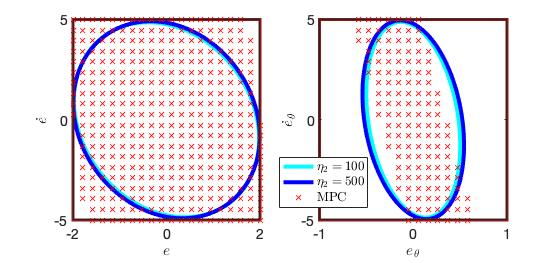

# IQCbased_ImitationLearning
This code is to accompany the paper [Imitation Learning with Stability and Safety Guarantees](https://arxiv.org/pdf/2012.09293.pdf). It learns a Neural Network controller with stability and safety guarantees through imitation learning process.

### Authors:
* He Yin (he_yin at berkeley.edu)
* Peter Seiler (pseiler at umich.edu)
* Ming Jin (jinming at vt.edu)
* Murat Arcak (arcak at berkeley.edu)

## Getting Started
The code is written in Python3 and MATLAB.

### Prerequisites
There are several packages required:
* [MOSEK](https://www.mosek.com/): Commercial semidefinite programming solver
* [CVX](http://cvxr.com/cvx/): MATLAB Software for Convex Programming
* [Tensorflow](https://www.tensorflow.org/): Open source machine learning platform

To plot the computed ROA, two more packages are required:
* [SOSOPT](https://dept.aem.umn.edu/~AerospaceControl/): General SOS optimization utility
* [Multipoly](https://dept.aem.umn.edu/~AerospaceControl/): Package used to represent multivariate polynomials

### Way of Using the Code
* To start the safe imitation learing process, go to each folder, run **NN_policy.py**. The computation results are stored in the folder **data**. 
* To visualize the results for the inverted pendulum example, run **result_analysis.m**.
For the GTM and vehicle lateral control examples, run **plot_generation.m**.

## ROAs of the Learned NN coontrollers and explicit MPC controller for the vehicle lateral control example 
